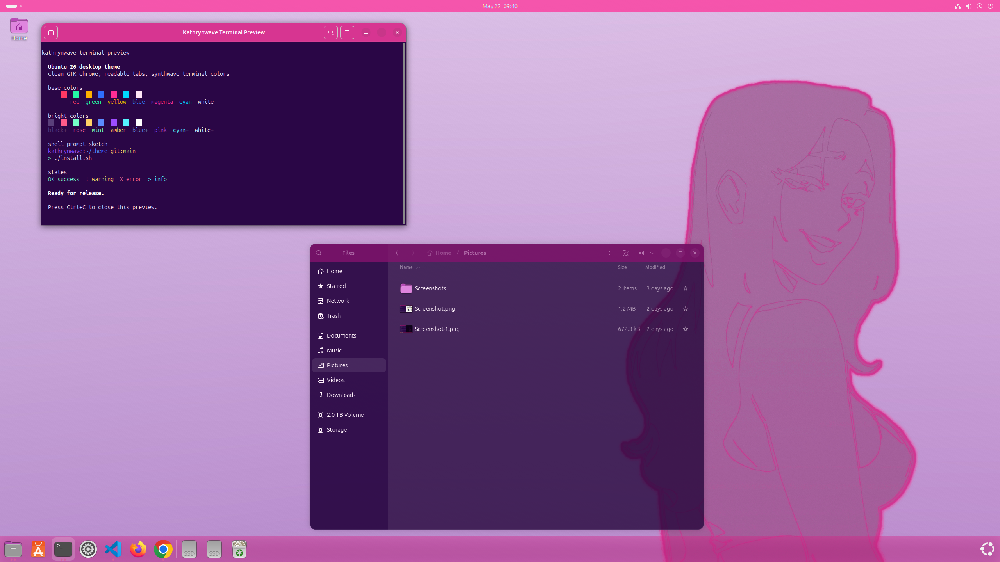
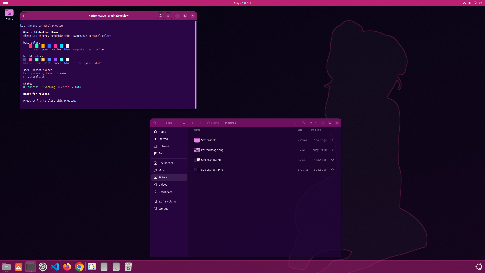
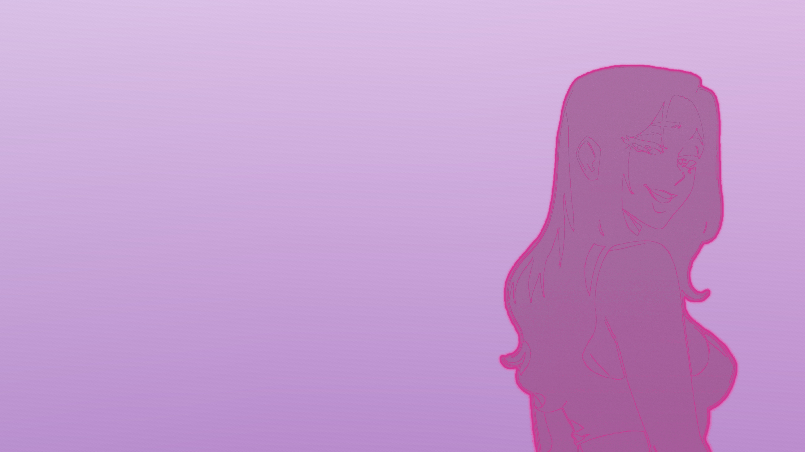
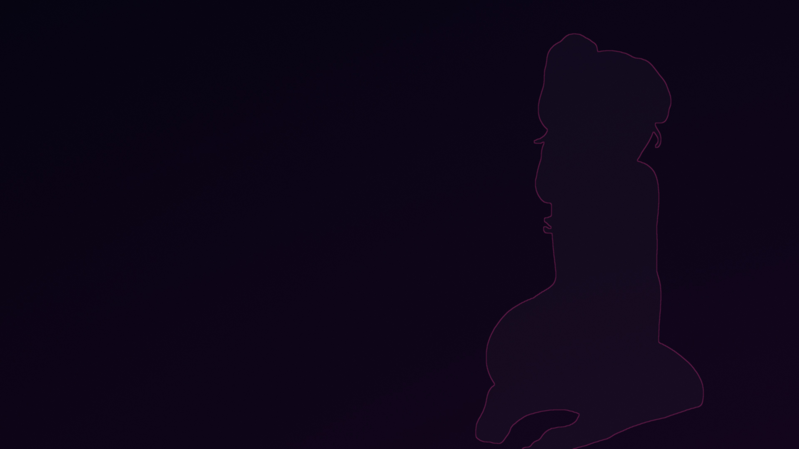

# kathrynwave 0.1.0

<p align="center">
  <strong>kathrynwave is a feel good Ubuntu 26 theme based on Ubuntu Yaru.</strong>
</p>

<p align="center">
  
  
</p>

<p align="center">
  <strong>Light desktop</strong> &nbsp;&nbsp;&nbsp; <strong>Dark desktop</strong>
</p>

<p align="center">
  
  
</p>

<p align="center">
  <strong>Default</strong> &nbsp;&nbsp;&nbsp; <strong>Dark</strong>
</p>

## Install

```sh
./install.sh
```

## Uninstall

```sh
./uninstall.sh
```

## Includes

- 💗 Pink Ubuntu accent
- 🌸 Light/dark GTK chrome
- 🌙 Day/night wallpapers
- 🖥️ GNOME Terminal colors and Bash prompt
- ✨ Transparent bottom dock and top-panel accent
- 🔒 No `sudo`, packages, icons, cursors, fonts, or spacing changes

After install, switch light and dark mode with Ubuntu's normal Appearance
control.

## Requirements

- Ubuntu 26.
- GNOME Terminal.
- Stock GNOME/Yaru components from the tested Ubuntu 26 install.
- GNOME User Themes Shell extension already installed/enabled for Shell accents.

Optional preflight:

```sh
./install.sh --check
```

Optional dry run:

```sh
./install.sh --dry-run
```

## License

Project code and docs are MIT. Bundled Yaru-derived resources keep their
upstream notices. The wallpapers are original kathrynwave artwork under CC BY
4.0, which allows reuse with credit.

See `LICENSE`, `THIRD_PARTY_NOTICES.md`, and `LICENSES/`.
